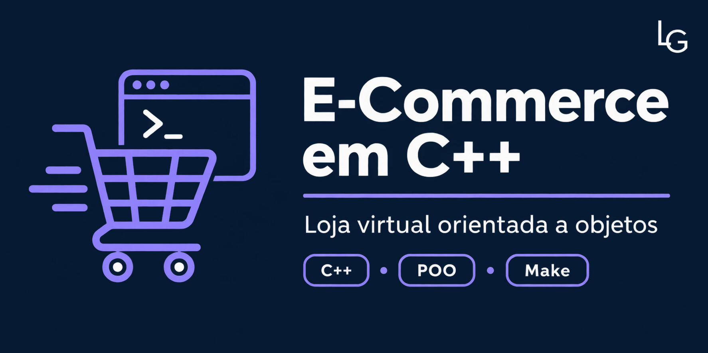

<p align="center">
  
</p>

# E-Commerce em C++

Sistema de loja virtual executado pelo terminal e desenvolvido com os conceitos de Programação Orientada a Objetos estudados na disciplina INF 112.

## Funcionalidades

- Cadastro e gerenciamento de produtos
- Perfis de administrador e usuário comum
- Carrinho de compras
- Inclusão e remoção de itens
- Aplicação de descontos
- Persistência e consulta do catálogo de produtos
- Interface interativa pelo terminal

## Conceitos aplicados

- Classes e objetos
- Encapsulamento
- Herança e especialização de usuários
- Separação de responsabilidades
- Composição entre carrinho, itens e produtos
- Compilação automatizada com Make

## Estrutura principal

| Componente | Responsabilidade |
|---|---|
| `Produto` | Representação dos produtos da loja |
| `BancoDadosProdutos` | Armazenamento e consulta do catálogo |
| `CarrinhoDeCompra` | Gerenciamento dos itens selecionados |
| `ItemDeCompra` | Associação entre produto e quantidade |
| `UsuarioComum` | Operações disponíveis ao cliente |
| `Admin` | Operações administrativas |
| `Desconto` e `DescontoFixo` | Regras de desconto |

## Como executar

É necessário possuir um compilador C++ e o utilitário `make` instalados.

```bash
make
./vai
```

Para remover os arquivos gerados pela compilação:

```bash
make clean
```

## Autores

- Lucas Góes
- Maxsuel da Silva

## Contexto acadêmico

Trabalho desenvolvido para a disciplina INF 112 — Programação II, na Universidade Federal de Viçosa.
